# Procesverslag
Markdown is een simpele manier om HTML te schrijven.  
Markdown cheat cheet: [Hulp bij het schrijven van Markdown](https://github.com/adam-p/markdown-here/wiki/Markdown-Cheatsheet).

Nb. De standaardstructuur en de spartaanse opmaak van de README.md zijn helemaal prima. Het gaat om de inhoud van je procesverslag. Besteedt de tijd voor pracht en praal aan je website.

Nb. Door *open* toe te voegen aan een *details* element kun je deze standaard open zetten. Fijn om dat steeds voor de relevante stuk(ken) te doen.

## Jij

  
uitwerken voor kick-off werkgroep

  ### Auteur:
  Wessel Glansbeek

  #### Je startniveau:
  Blauw

  #### Je focus:
  Surface plane
 

## Je website

  
uitwerken voor kick-off werkgroep

  ### Je opdracht:
  ajax.nl

  #### Screenshot(s) van de eerste pagina (small screen): 
  Homepagina 
  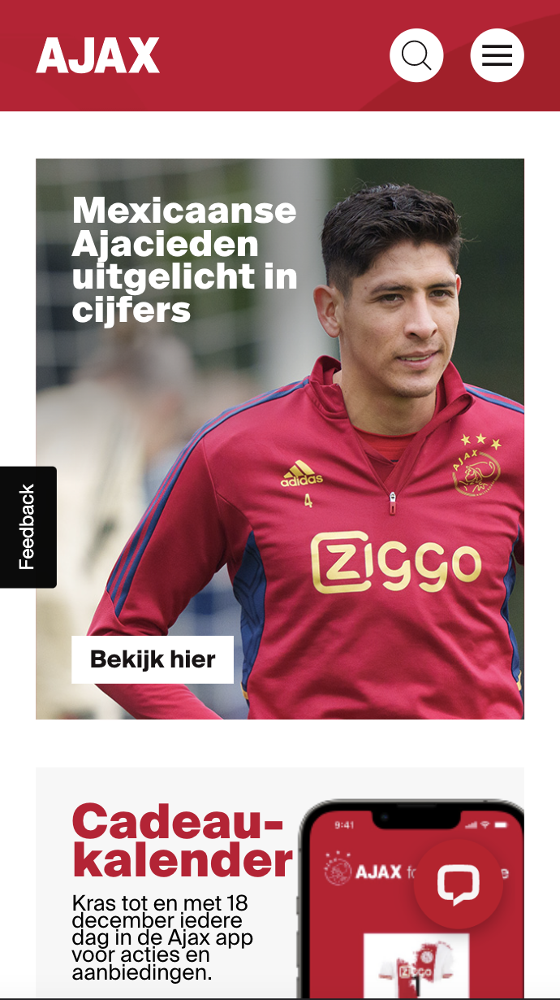

  #### Screenshot(s) van de tweede pagina (small screen):
  Ajax 1 
  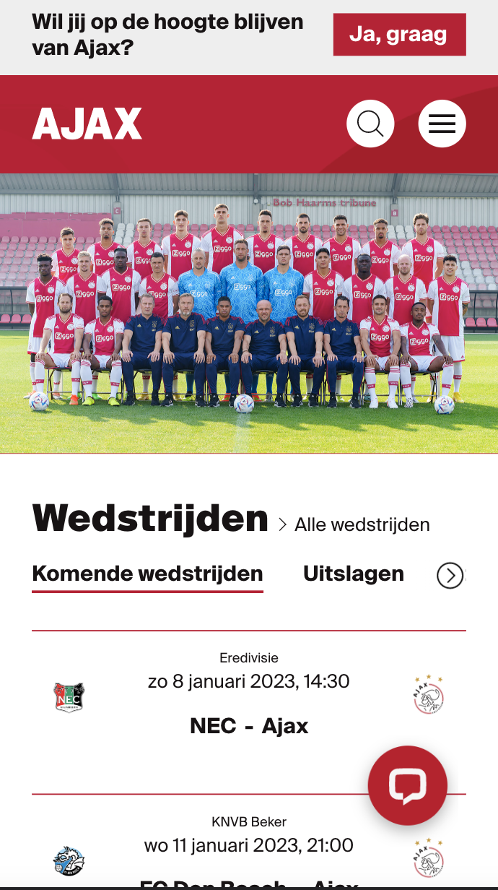
 

## Toegankelijkheidstest 1/2 (week 1)

  
uitwerken na test in 1e werkgroep

  ### Bevindingen
  Lijst met je bevindingen die in de test naar voren kwamen:

  #### Screenreader
  Bij mijn AJAX heb je 2 focussen. Verder werken alle links. Enige wat mij opviel was dat ie voor alle andere links als eerste de chatbot laat selecteren.

  Hier een omschrijving van hoe het opgelost kan worden (met indien nodig afbeeldingen)

  #### Muis en Toetsenbord 
  Alle klikbare elementen zijn ook daadwerkelijk klikbaar en hebben hovers. Dit is ook te navigeren met tab, alleen zie je dan niet waar je bent, je kunt alleen linksonderin zien waar je bent.

  #### Motoriek (shocks, elastiekjes)
  Website is met eerste standje (parkinson) prima te besturen, niet heel prettig, maar scrollen gaat makkelijk, klikken iets moeilijker. Je moet er wel geduld voor hebben.

  Met elastieken om je vinger ondervind ik geen last. Voelt niet prettig, maar alles is zelfde manier te besturen.

  Ballon hooghouden is vervelend, vereist wat oefening, maar de knoppen zijn groot genoeg om te besturen. 

  #### Visueel (brillen, contrast, kleurenblind, dark/light). 
  Met elke bril is het lastiger te bedienen. Met de brillen dat je zicht wazig wordt kan het nog wel normaal bedienen. Kost alleen wat meer moeite.
  Met de bril waar het oppervlakte van je zicht beperkt wordt moet je constant je hoofd bewegen om te kunnen zien waar je naar toe navigeert.

  Hieronder volgen alle verschillende soorten kleurenblindheid in combinatie met ajax.nl. Voor het gebruik is dit allemaal goed ontworpen. Kleuren veranderen uiteraard maar er blijft ten alle tijde genoeg contrast. Alleen bij volledig zwartwit zie je de hovers niet goed bij sommige linkjes, te weinig onderscheid.

  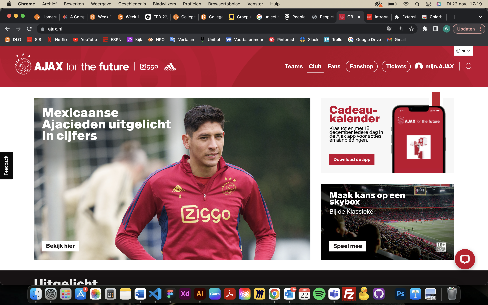
  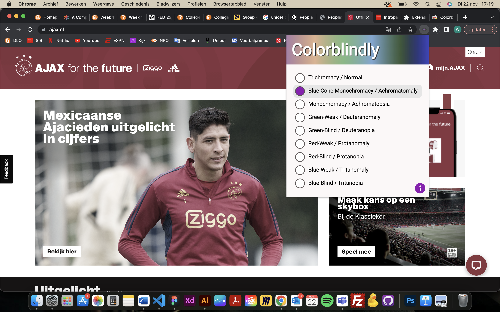
  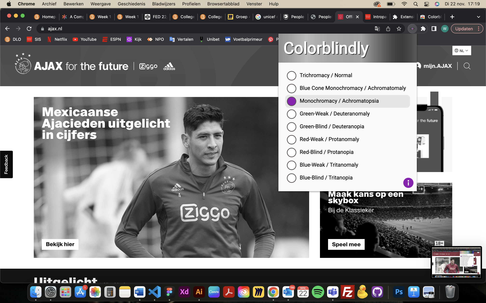
  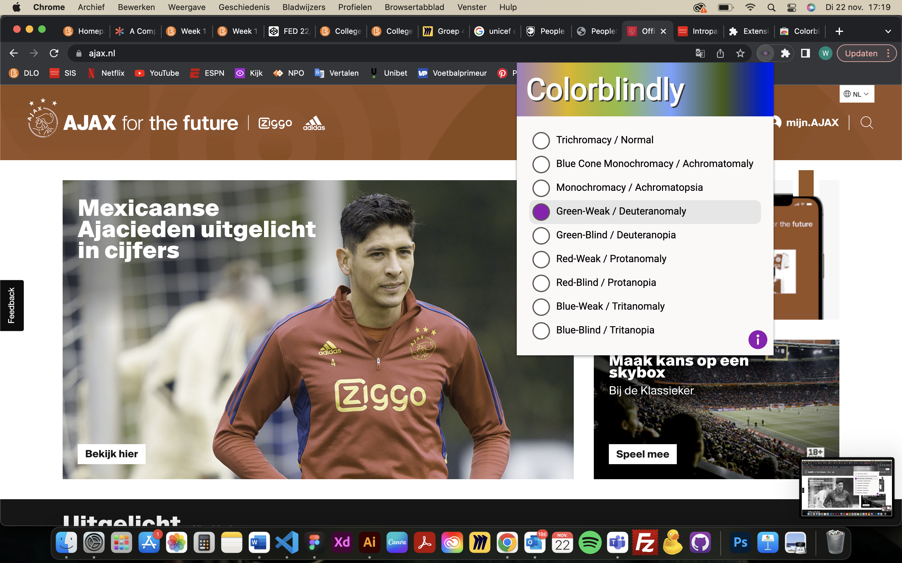
  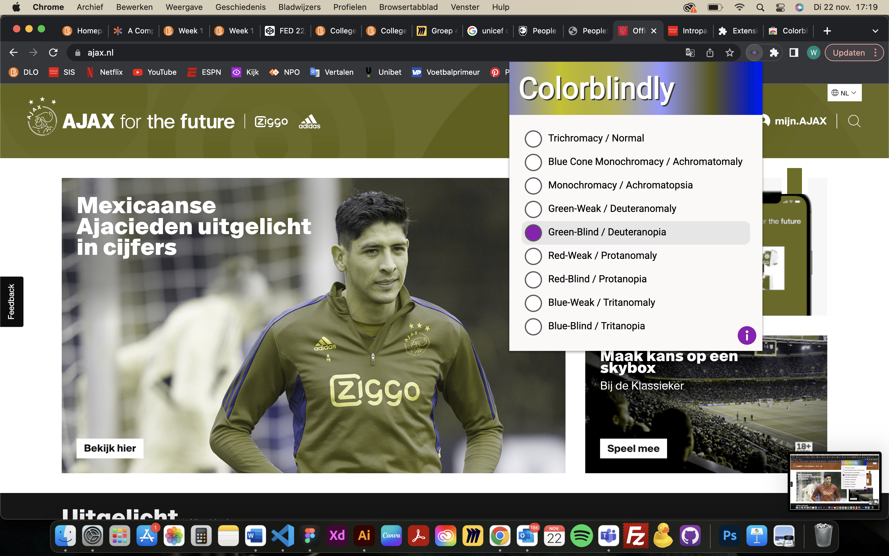
  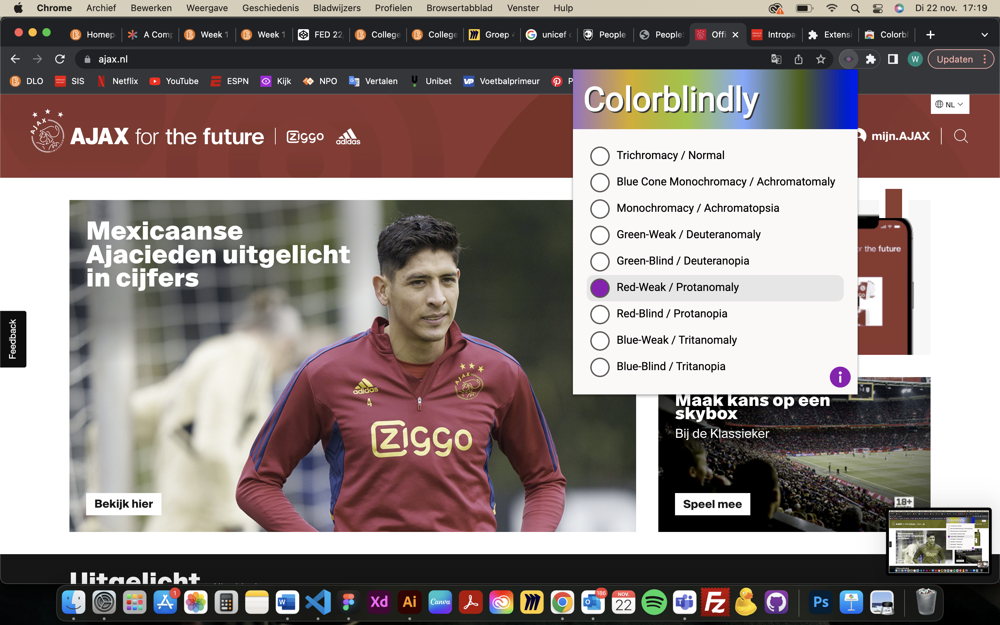
  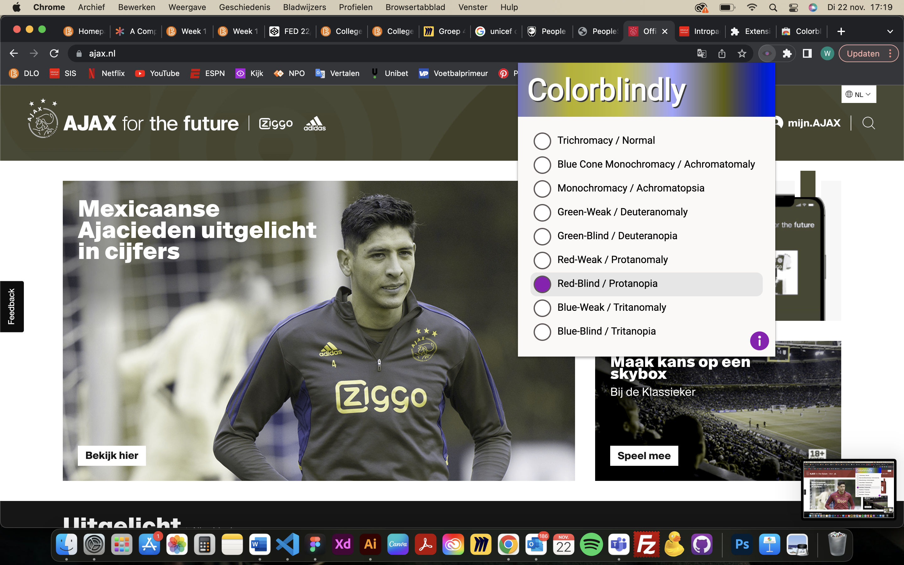
  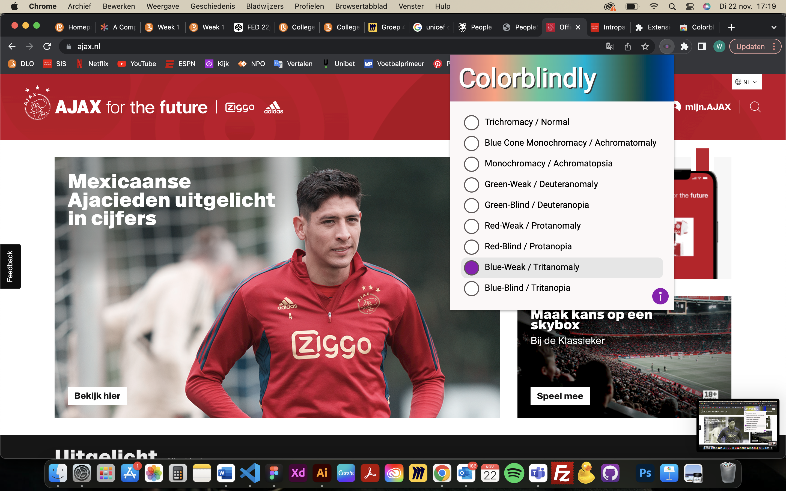
  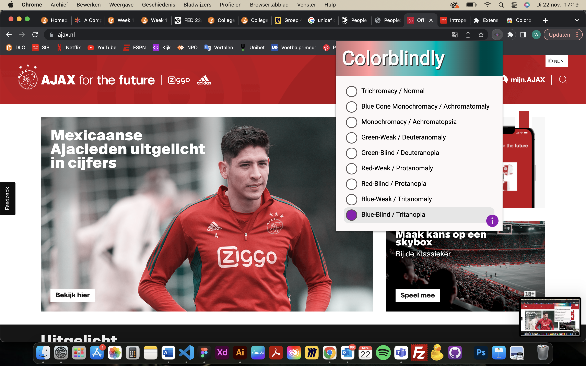

Er verandert niks met darkmode.

## Breakdownschets (week 1)

  
uitwerken na afloop 2e werkgroep

  ### de hele pagina: 
  

  ### dynamisch deel (bijv menu): 
  

  ### wellicht nog een dynamisch deel (bijv filter): 
  

## Voortgang 1 (week 2)

  
uitwerken voor 1e voortgang

  ### Stand van zaken
  hier dit ging goed & dit was lastig (neem ook screenshots op van delen van je website en code)

  ### Agenda voor meeting
  samen met je groepje opstellen

   | Menno:

  | Vraag over CSS grid, een button blijft niet binnen het grid, standaard styling van

  | de button blijft groter

  | Hilal:

  | Vraag over de breakdown schets

  | Laiba:

  | vraag over font

  | css bestanden

  | vraagje over een html element (pijltjes)

  | Wessel:

  | Vraag over wanneer je grid gebruikt en wanneer flexbox

  ### Verslag van meeting
  hier na afloop snel de uitkomsten van de meeting vastleggen

  - punt 1
  - punt 2
  - nog een punt
  - ...

## Voortgang 2 (week 3)

  
uitwerken voor 2e voortgang

  ### Stand van zaken
  hier dit ging goed & dit was lastig (neem ook screenshots op van delen van je website en code)

  ### Agenda voor meeting
  Hilal:
  Vraag 1: Doe ik de fontface goed op deze manier?
  Vraag 2: Vind een carousel starten lastig, vooral als je bij het swipen de nummers ziet veranderen zoals op mijn site. Hoe kan ik dit het beste aanpakken en heb ik hier javascript voor nodig?
  Vraag 3: Een stukje van me hamburger menu gaat mee bij het scrollen, waardoor komt dit?

  Menno:
  Vraag 1: ik heb een vraag over het semantisch maken van mijn HTML, mijn CSS luistert niet en ik weet niet hoe het komt.

  Laiba:
  vraag 1 (formulieren):
  Formulieren, hoe moet je erin verwerken?
  Mag ik het verstoppen?  
  (Surface plane)
  vraag 2 (img):
  3 images kan ik nergens vinden (inspect network)
  Vraag 3 (hamburger menu):
  ik zie naast de hamburger menu icon mijn andere icons niet

  Wessel:
  Vraag 1: Hamburger menu openen lukt, maar weer sluiten lukt niet. Hoe komt dit?
  Vraag 2: Display flex items plaatsen hoe ik wil zonder, losse items van space between
  Vraag 3: Hoe ontwerp je het kruisje dat input form leegt?

  ### Verslag van meeting
  hier na afloop snel de uitkomsten van de meeting vastleggen

  - punt 1
  - punt 2
  - nog een punt
- ...

## Toegankelijkheidstest 2/2 (week 4)

  
uitwerken na test in 8e werkgroep

  ### Bevindingen
  Lijst met je bevindingen die in de test naar voren kwamen (geef ook aan wat er verbeterd is):

  #### Screenreader
  Hier korte omschrijving (met indien nodig afbeeldingen)

  Hier een omschrijving van hoe het opgelost kan worden (met indien nodig afbeeldingen)

  #### Muis en Toetsenbord 
  Hier korte omschrijving (met indien nodig afbeeldingen)

  Hier een omschrijving van hoe het opgelost kan worden (met indien nodig afbeeldingen)

  #### Motoriek (shocks, elastiekjes)
  Hier korte omschrijving (met indien nodig afbeeldingen)

  Hier een omschrijving van hoe het opgelost kan worden (met indien nodig afbeeldingen)

  #### Visueel (brillen, contrast, kleurenblind, dark/light). 
  Hier korte omschrijving (met indien nodig afbeeldingen)

  Hier een omschrijving van hoe het opgelost kan worden (met indien nodig afbeeldingen)

## Voortgang 3 (week 4)

  
uitwerken voor 3e voortgang

  ### Stand van zaken
  hier dit ging goed & dit was lastig (neem ook screenshots op van delen van je website en code)

  ### Agenda voor meeting
  samen met je groepje opstellen

  | student 1      | student 2          | student 3    | student 4        |
  | ---            | ---                | ---          | ---              |
  | dit bespreken  | en dit             | en ik dit    | en dan ik dat    |
  | en dat ook nog | dit als er tijd is | nog een punt | dit wil ik zeker |
  | ...            | ...                | ...          | ...              |

  ### Verslag van meeting
  hier na afloop snel de uitkomsten van de meeting vastleggen

  - punt 1
  - punt 2
  - nog een punt
  - ...

## Eindgesprek (week 5)

  
uitwerken voor eindgesprek

  ### Je uitkomst - karakteristiek screenshots:
  

  ### Dit ging goed/Heb ik geleerd: 
  Korte omschrijving met plaatjes

  

  ### Dit was lastig/Is niet gelukt:
  Korte omschrijving met plaatjes

  

## Bronnenlijst

  
continu bijhouden terwijl je werkt

  Nb. Wees specifiek ('css-tricks' als bron is bijv. niet specifiek genoeg).

  1. bron 1
  2. bron 2
  3. ...

